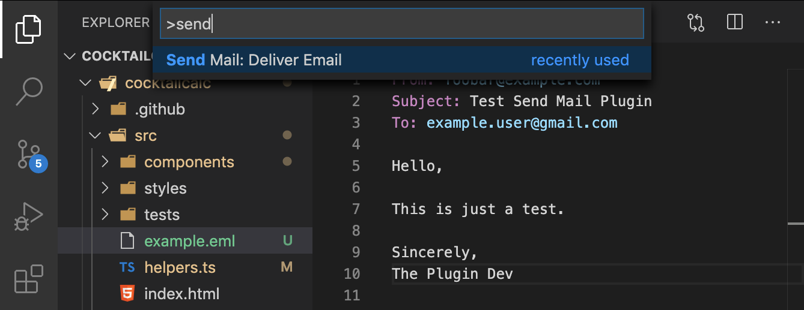

# Send Mail

Visual Studio Code extension. This extension routes an email over the Internet to specified recipients. It uses the [sendmail](http://www.postfix.org/sendmail.1.html) MTA to do the email routing. Currently this extension only works on Linux and macOS.

## Features

Send an email to all specified recipients from VSCode.

**Command Palette**:

## Requirements

This extension uses [sendmail](http://www.postfix.org/sendmail.1.html) for the actual email routing and as such only works on Linux and macOS at the moment.

## Known Issues

* The file needs to be saved to the file system before you can use the "Send Email" command.

## Release Notes

### 1.0.0

* Initial Release
